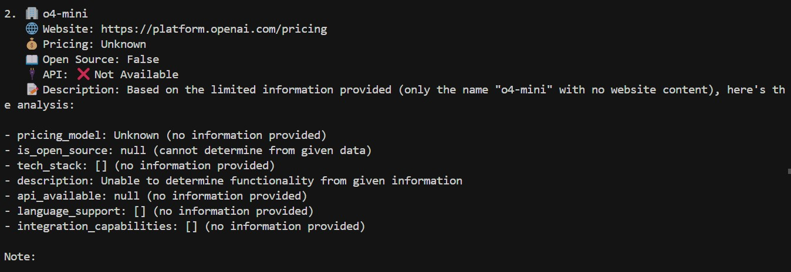

# 🤖 AI Agent - Developer Tools Research Assistant

<div align="center">


*An intelligent AI agent that researches and analyzes developer tools, technologies, and platforms to provide comprehensive recommendations. Built with LangGraph, DeepSeek AI, and Firecrawl for web scraping and analysis.*

[](https://python.org)
[](LICENSE)
[](http://makeapullrequest.com)

</div>

---

## 📸 Demo Screenshots

<div align="center">

### 🚀 Tool Discovery & Analysis

*AI Agent discovering and analyzing developer tools*

### 🔍 Detailed Company Research  

*Comprehensive analysis of tool features, pricing, and tech stacks*

### 💡 Intelligent Recommendations

*AI-generated actionable recommendations for developers*

</div>

---

## 🚀 Features

<div align="center">

| 🔍 **Discovery** | 🧠 **Intelligence** | 📊 **Analysis** | 💡 **Recommendations** |
|:---:|:---:|:---:|:---:|
|  |  |  |  |

</div>

### ✨ Key Capabilities

<div align="center">


</div>

- **🔍 Intelligent Tool Discovery**: Automatically finds and extracts relevant developer tools from articles and web content
- **📊 Comprehensive Analysis**: Analyzes pricing models, tech stacks, API availability, and integration capabilities  
- **🤖 DeepSeek AI Integration**: Uses DeepSeek AI through OpenRouter for intelligent content analysis
- **🕷️ Web Scraping**: Leverages Firecrawl for efficient web content extraction
- **💡 Structured Recommendations**: Provides detailed, actionable recommendations for developer tools

## 🏗️ Architecture

<div align="center">

### 🔄 LangGraph Workflow Pipeline

```mermaid
graph LR
    A[🔍 User Query] --> B[📰 Tool Extraction]
    B --> C[🏢 Company Research]
    C --> D[💡 Recommendation Generation]
    D --> E[📊 Final Results]
    
    style A fill:#e1f5fe
    style B fill:#f3e5f5
    style C fill:#e8f5e8
    style D fill:#fff3e0
    style E fill:#fce4ec
```



</div>

### 🎯 Three-Stage Process

<div align="center">

| Stage | 🔍 **Tool Extraction** | 🏢 **Company Research** | 💡 **Recommendation Generation** |
|:---:|:---|:---|:---|
| **Input** | User query | Extracted tool names | Analyzed company data |
| **Process** | Web scraping + AI extraction | Website analysis + AI parsing | Data synthesis + AI recommendations |
| **Output** | List of relevant tools | Detailed company profiles | Actionable recommendations |

</div>

**The project uses a sophisticated LangGraph workflow with three main stages:**

1. **🔍 Tool Extraction**: Searches for articles and extracts relevant tool names using AI
2. **🏢 Company Research**: Analyzes individual tools and their features in detail  
3. **💡 Recommendation Generation**: Provides comprehensive, actionable recommendations

## 📋 Prerequisites

<div align="center">


</div>

### 🛠️ Required Tools

- **🐍 Python 3.12+** - Modern Python with latest features
- **📦 [uv](https://docs.astral.sh/uv/)** - Fast Python package manager
- **🔑 Firecrawl API Key** - For web scraping capabilities
- **🤖 OpenRouter API Key** - For DeepSeek AI access (optional)

## 🛠️ Installation

<div align="center">

### 🚀 Quick Start Guide

   

</div>

### 📥 1. Clone the Repository

```bash
git clone <your-repository-url>
cd advance-agent
```

<div align="center">


</div>

### 📦 2. Install Dependencies

The project uses `uv` for fast dependency management:

```bash
uv sync
```

<div align="center">


</div>

### 🔧 3. Set Up Environment Variables

Create a `.env` file in the project root:

```bash
# Firecrawl API Key (required for web scraping)
FIRECRAWL_API_KEY=your_firecrawl_api_key_here

# Optional: OpenRouter API Key (if you want to use your own)
OPENROUTER_API_KEY=your_openrouter_api_key_here
```

<div align="center">


</div>

### 🔑 4. Get API Keys

<div align="center">

| 🔥 **Firecrawl API Key** | 🤖 **OpenRouter API Key** |
|:---:|:---:|
|  |  |

</div>

#### 🔥 Firecrawl API Key (Required)
<div align="center">

  

</div>

1. 🌐 Visit [Firecrawl](https://firecrawl.dev/)
2. 📝 Sign up for an account
3. 🎯 Navigate to your dashboard
4. 🔑 Copy your API key

#### 🤖 OpenRouter API Key (Optional)
<div align="center">

  

</div>

1. 🌐 Visit [OpenRouter](https://openrouter.ai/)
2. 💳 Sign up and add credits to your account
3. 🎯 Navigate to your dashboard
4. 🔑 Copy your API key

## 🚀 Usage

<div align="center">

### 🎯 Quick Start


</div>

### 📝 Basic Usage

```python
from src.workflow import Workflow

# 🚀 Initialize the workflow
workflow = Workflow()

# 🔍 Run research on a specific query
result = workflow.run("database management tools")

# 📊 Access the results
print(f"Query: {result.query}")
print(f"Extracted Tools: {result.extracted_tools}")
print(f"Companies Analyzed: {len(result.companies)}")
print(f"Analysis: {result.analysis}")
```

<div align="center">


</div>

### 🔍 Example Queries

<div align="center">

| 🗄️ **Databases** | ☁️ **Cloud** | 📊 **Monitoring** | 🔐 **Security** |
|:---:|:---:|:---:|:---:|
|  |  |  |  |

</div>

```python
# 🗄️ Research database tools
result = workflow.run("PostgreSQL alternatives")

# ☁️ Research deployment platforms  
result = workflow.run("cloud deployment platforms")

# 📊 Research monitoring tools
result = workflow.run("application monitoring tools")

# 🔐 Research authentication services
result = workflow.run("authentication providers")
```

<div align="center">


</div>

## 📁 Project Structure

<div align="center">

### 🗂️ File Organization

```
📦 advance-agent/
├── 📁 src/
│   ├── 📄 __init__.py
│   ├── 🚀 workflow.py          # Main workflow implementation
│   ├── 📊 models.py            # Pydantic data models
│   ├── 🕷️ firecrawl.py         # Firecrawl service wrapper
│   └── 🤖 prompts.py           # AI prompts for analysis
├── ⚙️ pyproject.toml           # Project configuration
├── 🔒 uv.lock                  # Dependency lock file
├── 📸 1st.jpg                  # Demo screenshot 1
├── 📸 2nd.jpg                  # Demo screenshot 2
├── 📸 3rd.jpg                  # Demo screenshot 3
└── 📖 README.md               # This file
```

</div>

<div align="center">

| File | Purpose | Status |
|:---:|:---|:---:|
|  | Core workflow implementation | ✅ |
|  | Pydantic data structures | ✅ |
|  | Firecrawl service wrapper | ✅ |
|  | AI prompt templates | ✅ |

</div>

## 🔧 Configuration

### DeepSeek AI Configuration

The project is configured to use DeepSeek AI through OpenRouter. The configuration is in `src/workflow.py`:

```python
self.client = OpenAI(
    base_url="https://openrouter.ai/api/v1",
    api_key="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",
)
```

**Model Used**: `deepseek/deepseek-chat-v3-0324:free`

### Customizing the Model

To use a different model or your own OpenRouter API key:

1. Update the API key in `src/workflow.py`
2. Change the model name in the `_create_deepseek_llm` method

## 🔍 How It Works

### 1. Tool Extraction Phase

```python
def _extract_tools(self, state: ResearchState):
    # Search for articles about the query
    articles_query = f"{state.query} tools comparison best alternatives"
    search_results = self.firecrawl.search_companies(articles_query, num_results=5)
    
    # Scrape content from found articles
    # Extract tool names using DeepSeek AI
    # Return list of extracted tools
```

**What it does:**
- Searches for articles related to the query
- Scrapes content from found URLs
- Uses AI to extract specific tool names from the content
- Returns a list of relevant tools

### 2. Company Research Phase

```python
def _get_company_info(self, state: ResearchState):
    # For each extracted tool
    for tool_name in tool_names:
        # Search for the tool's official website
        # Scrape the website content
        # Analyze the content using AI
        # Extract pricing, tech stack, features, etc.
```

**What it does:**
- Takes the extracted tool names
- Searches for each tool's official website
- Scrapes detailed information from the websites
- Uses AI to analyze pricing, tech stack, API availability, etc.

### 3. Recommendation Generation Phase

```python
def _analyze_step(self, state: ResearchState):
    # Combine all analyzed company data
    # Generate comprehensive recommendations
    # Provide actionable insights
```

**What it does:**
- Combines all the analyzed company information
- Uses AI to generate comprehensive recommendations
- Provides actionable insights and comparisons

## 📊 Data Models

### CompanyAnalysis

```python
class CompanyAnalysis(BaseModel):
    pricing_model: str = "Unknown"  # Free, Freemium, Paid, Enterprise
    is_open_source: Optional[bool] = None
    tech_stack: List[str] = []
    description: str = ""
    api_available: Optional[bool] = None
    language_support: List[str] = []
    integration_capabilities: List[str] = []
```

### CompanyInfo

```python
class CompanyInfo(BaseModel):
    name: str
    description: str
    website: str
    pricing_model: Optional[str] = None
    is_open_source: Optional[bool] = None
    tech_stack: List[str] = []
    competitors: List[str] = []
    api_available: Optional[bool] = None
    language_support: List[str] = []
    integration_capabilities: List[str] = []
    developer_experience_rating: Optional[str] = None
```

### ResearchState

```python
class ResearchState(BaseModel):
    query: str
    extracted_tools: List[str] = []
    companies: List[CompanyInfo] = []
    search_results: List[Dict[str, Any]] = []
    analysis: Optional[str] = None
```

## 🤖 AI Prompts

The project uses carefully crafted prompts for different analysis tasks:

### Tool Extraction Prompt
Extracts specific tool names from articles and content.

### Tool Analysis Prompt
Analyzes company websites to extract:
- Pricing model
- Tech stack
- API availability
- Language support
- Integration capabilities

### Recommendation Prompt
Generates actionable recommendations based on all analyzed data.

## 🔧 Troubleshooting

### Common Issues

#### 1. Firecrawl API Key Error
```
ValueError: FIRECRAWL_API_KEY is not set in the environment variables
```

**Solution**: Make sure you have set the `FIRECRAWL_API_KEY` in your `.env` file.

#### 2. DeepSeek API Error
```
openai.AuthenticationError: Invalid API key
```

**Solution**: The project uses a pre-configured API key. If you want to use your own, update it in `src/workflow.py`.

#### 3. Import Errors
```
ModuleNotFoundError: No module named 'openai'
```

**Solution**: Run `uv sync` to install all dependencies.

#### 4. Search Results Format Issues
```
AttributeError: 'tuple' object has no attribute 'get'
```

**Solution**: The code handles multiple response formats from Firecrawl. This error should be resolved in the current version.

### Debug Mode

To enable debug logging, you can add print statements in the workflow methods or modify the logging level.

## 🧪 Testing

### Test the Installation

```bash
# Test that all imports work
uv run python -c "from src.workflow import Workflow; print('✓ All imports successful')"
```

### Test the Workflow

```python
from src.workflow import Workflow

# Test with a simple query
workflow = Workflow()
result = workflow.run("database tools")
print(f"Found {len(result.extracted_tools)} tools")
print(f"Analyzed {len(result.companies)} companies")
```

## 📈 Performance

<div align="center">

### ⚡ Speed Metrics

| Stage | ⏱️ **Time** | 🚀 **Status** |
|:---:|:---|:---:|
| **Tool Extraction** | ~30-60 seconds |  |
| **Company Analysis** | ~2-5 minutes per tool |  |
| **Recommendation Generation** | ~10-30 seconds |  |

</div>

<div align="center">

### 🎯 Total Performance


</div>

**⚡ Total time**: 3-10 minutes depending on the number of tools found and analyzed.

## 🔒 Security

<div align="center">

### 🛡️ Security Features


</div>

<div align="center">

| 🔐 **API Security** | 🚫 **Data Protection** | 🌐 **Web Ethics** | ⚡ **Rate Limiting** |
|:---:|:---:|:---:|:---:|
|  |  |  |  |

</div>

- **🔐 API Security**: API keys are stored in environment variables
- **🚫 Data Protection**: No sensitive data is logged or stored
- **🌐 Web Ethics**: All web scraping follows robots.txt guidelines
- **⚡ Rate Limiting**: Rate limiting is implemented for API calls

## 🤝 Contributing

1. Fork the repository
2. Create a feature branch (`git checkout -b feature/amazing-feature`)
3. Commit your changes (`git commit -m 'Add some amazing feature'`)
4. Push to the branch (`git push origin feature/amazing-feature`)
5. Open a Pull Request

## 📝 License

This project is licensed under the MIT License - see the [LICENSE](LICENSE) file for details.

## 🙏 Acknowledgments

- [LangGraph](https://github.com/langchain-ai/langgraph) for workflow orchestration
- [DeepSeek AI](https://www.deepseek.com/) for intelligent analysis
- [Firecrawl](https://firecrawl.dev/) for web scraping capabilities
- [OpenRouter](https://openrouter.ai/) for AI model access

## 📞 Support

If you encounter any issues or have questions:

1. Check the [Troubleshooting](#troubleshooting) section
2. Search existing [Issues](https://github.com/your-repo/issues)
3. Create a new issue with detailed information

## 🔄 Updates

Stay updated with the latest changes:

```bash
git pull origin main
uv sync
```

---

<div align="center">

### 🎉 Ready to Get Started?


```bash
git clone <your-repo-url>
cd advance-agent
uv sync
python example.py
```

### 🌟 Star This Repository

If this project helps you, please give it a ⭐️!

[](https://github.com/your-username/your-repo)
[](https://github.com/your-username/your-repo/fork)

### 📞 Need Help?

<div align="center">


</div>

---

<div align="center">

**Made with ❤️ by Surya Prakash Subudhiray**


**Happy coding! 🚀**

</div>
